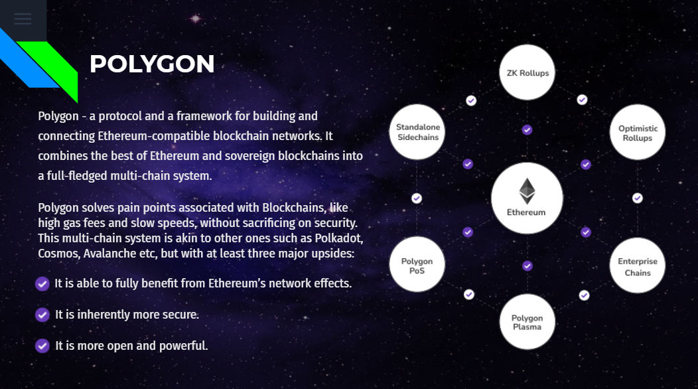
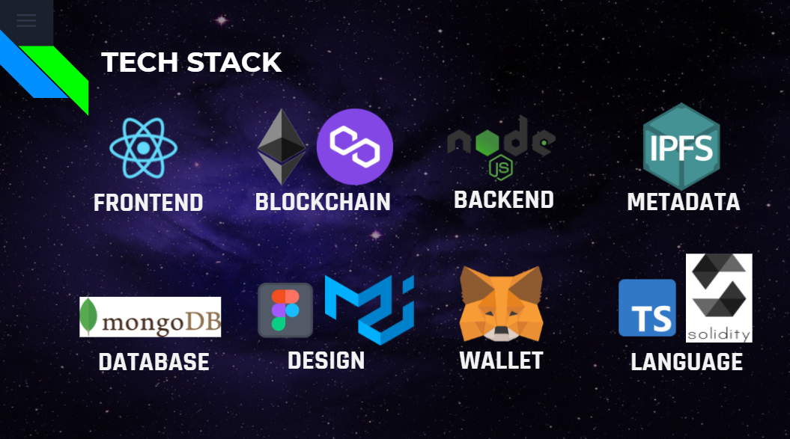

<h1> OXYLUS </h1>
<h3>Platform for Business Owners to contribute and connect with SDG projects using blockchain as backbone</h3>

<p> Oxylus is a blockchain based web solution for achieveing UN 17 Sustainable Development Goals. It encourages and works as a partnership accelerator with decentralised control over the system. </p>

<details open="open">
  <summary>Table of Contents</summary>
  <ol>
    <li><a href="#inspiration">Inspiration</a></li>
    <li><a href="#about-the-project">About the project</a></li>
    <li><a href="#working-steps">Working Steps</a></li>
    <li><a href="#use-case-diagram">Use Case Diagram</a></li>
    <li><a href="#user-structure">User Structure</a></li>
    <li><a href="#data-definations">Data Definations</a></li>
    <li><a href="#data-Structure">Data Structure</a></li>
    <li><a href="#polygon">Polygon</a></li>
    <li><a href="#technologies-used">Technologies used</a></li>
    <li><a href="#future-scope">Future Scope</a></li>
    <li><a href="#societal-impacts">Societal Impacts</a></li>
    <li><a href="#guide-to-setup-the-project-locally">Guide to setup the project locally</a></li>
    <li><a href="#guide-to-try-out-our-platform">Guide to try out our platform</a></li>
    <li><a href="#references">References</a></li>
    <li><a href="#acknowledgements">Acknowledgements</a></li>
  </ol>
</details>

## Inspiration

There's a lot industrialization has done to the Earth. Clearing the earth crust decade by decade in search of these fuels and natural resources, human discovered a lot of things at an exponential rate. So also emitted CO2 and harmful chemicals in the environment.
In the last century, Human not corrupted the earth by just only burning of fossil fuels but also indiscriminiate exploitation of resources.

UN realised they need to work now or the earth will be destroyed by just one greedy species. So, in the 2010 united nations introduced SDG (Sustainable Development Goals) which the responsibility of every nation to be fulfilled in the next two decades means till 2030.

This program needs to be accelerated now as half time has gone and work needs to be done. So UN decided to run a project named partnership accelerator program – The Partnership Accelerator aims to develop the partnership-enabling ecosystem (see above) which can support the engagement of business as a partner in sustainable development and accelerate the number and effectiveness of partnerships towards delivering the 2030 Agenda.

Oxylus acts as a medium to accelerate partnership by providing companies willing for CSRs and project managers. Best part about it is decentralization of power which is explanied in subsequent topics.

## About the Project

Oxylus is a platform where organisations from all over the world and business owners can connect to each other and transfer funds and resources to achieve SDG. Organisations like Government orgs, NGOs, TPI, etc. can announce their projects and requirements about the project on our platform.

Business owners from all the over the world can see these projects and contribute in it. UN in its partnership accelerator program wants involvement of businesses in SDG projects and this is what our platform does.

This platform will help project organisers to get required funds and human resource to complete and accelerate the process of SDG. Businesses have strong knowledge of the current market so by involving them in projects organisers also benefits. Businesses will not only help them with money but also will connect and guide them in choosing right service providers. This will create the most optimal projects that will last long unlike government.

## Working Steps

1.  Project organisers can create different projects on our platforms. They will fill all the required MetaData to create a base template of a project first then add the details to look it more impressive for the business owners.

2.  After filling the required metadata and filedata. Project organisers to create their Odata which is set of milestones, each milestones containing request and respective metadata and filedata for that, etc.

3.  Business owners now can see projects on platforms which needs funding and pool created for each project. They can contribute by donating funds in pools or by providing human resource support directly. Donating the funds will store their funds in smart contracts for the respective project on chain. The transaction details will be displayed and the pool contributions are open to all. But the business which will donate more than the min contribution specified by the project organisers only counted as legal voters in upcoming events.

4.  Once the pool is getting funded. Project organisers can start to work on requests. Requests will be created by the project organisers in milestones with requirements they need. Business owners who are legal voters in the system now can vote for the requests future.

5.  Voting will be done and if the result is positive, funds will be transferred to the service provider’s wallet. Now service provider will provide the required resources to project organiser.

6.  If the voting result is negative, funds will remain intact in pool like nothing happened. The request will be marked as cancelled so now organizer can improve its previous request to not fail second time by taking suggestions or recommendations discussing with the business owners and their representatives.

7.  The communication will boost the project organisers and project abilities to next level as they will get direct guidance from industry leaders and their peers in developing the project. (Ex.- Project powering the whole city with solar will get guidance from companies like tesla where they can discuss which batteries should be used to get the most brilliant model for the upcoming decades of this city and their residents)

## Use Case Diagram

<p align="center">
  
</p>

## User Structure

<p align="center">
  
</p>

## Data Definations

<p align="center">
  
</p>

## Data Models

<p align="center">
  
  
</p>

## Polygon

<p align="center">
  
</p>

## Technologies Used

<p align="center">
  
</p>

## Future Scope

1.  In future, an option for the project to create their own green crypto token, and send some percentage to the investors in the proportion of amount funded by the investors as a reward and thanksgiving for the successfully completion of the project can be added.

2.  Fundpools can be developed with some interest generating mechanism so the fund in pools will generate some interest over time.

## Guide to setup project locally

### Prerequisites

You need to have latest version of node and npm installed in your local machine.

-   npm
    ```sh
    npm install npm@latest -g
    ```

### Installation

1. Clone the repo
    ```sh
    git clone https://github.com/Nexus-Bot/BizFundWeb/tree/master
    ```
2. Install NPM packages
    ```sh
    npm install
    ```
3. Run the Local Server
    ```sh
    npm run start
    ```

## Guide to try out our app

To actually try out our platform, there are certain requirements to set up, which include :

-   Install Metamask wallet in your browser. [Install from here](https://chrome.google.com/webstore/detail/metamask/nkbihfbeogaeaoehlefnkodbefgpgknn?hl=en)
-   Use a standard Polygon faucet to get Testnet MATIC tokens. [Faucet](https://faucet.polygon.technology/)
-   Currently Smart Contracts are deployed on Polygon Test Network (Mumbai Testnet).
    -   Network : Matic Mumbai
    -   RPC : https://rpc-mumbai.maticvigil.com/
    -   Block Explorer : https://mumbai.polygonscan.com/
-   Enjoy!

## Societal Impacts

1.  Platform will accelerate the number and effectiveness of partnerships towards delivering the 2030 SDG Agenda.

2.  Empowering green crypto currencies will result in healthy environment, thriving society and prosperous economy.

3.  Businesses will help UN to achieve SDG by creating a supply chain between project orgs and service providers.

4.  People will believe in SDG projects as blockchain ensures it will be scam free. Transparency of transactions will increase peoples trust.

## References

1.  [TPI - The Partnership Guide Book](https://thepartneringinitiative.org/publications/toolbook-series/the-sdg-partnerships-guidebook/)
2.  [Solidity](https://docs.soliditylang.org/en/v0.8.7/)
3.  [Ethereum](https://ethereum.org/en/developers/)
4.  [Web3](https://web3js.readthedocs.io/en/v1.5.2/)
5.  [Polygon](https://polygon.technology/)
6.  [ReactJs](https://reactjs.org/)
7.  [Node.js](https://nodejs.org/en/)
8.  [Express.js](https://expressjs.com/)
9.  [MongoDB](https://www.mongodb.com/)
10. [Material-UI](https://mui.com/)

## Acknowledgements

1.  [United Nations](https://www.un.org/en/)
2.  [United Nations - Decade of Action](https://www.un.org/sustainabledevelopment/decade-of-action/)
